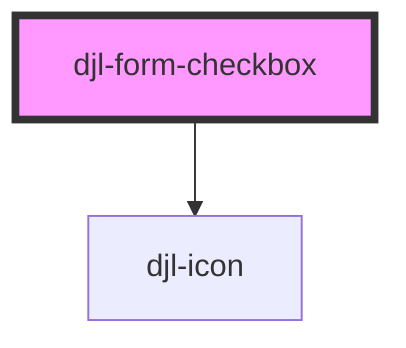

# form-checkbox

## Usages
### List Style
```html
<djl-form-checkbox
  label="Pizza Toppings"
  description="Description Text"
  hint="Select all that apply."
  error-text="This field is required."
  required>
  <input type="checkbox" id="default-1">
  <label for="default-1">Toppings</label><br/>
  <input type="checkbox" id="default-2">
  <label for="default-2">Pepperoni</label>
</djl-form-checkbox>
```
### Parent Child Style
```html
<djl-form-checkbox
  label="Pizza Toppings"
  description="Description Text"
  hint="Select all that apply."
  error-text="This field is required."
  type="parent-child"
  >
  <input type="checkbox" id="parent-1">
  <label for="default-1">Parent</label><br/>
  <input type="checkbox" id="child-1">
  <label for="default-2">Child 1</label><br/>
  <input type="checkbox" id="child-2">
  <label for="default-2">Child 2</label><br/>
</djl-form-checkbox>
```

<!-- Auto Generated Below -->


## Properties

| Property      | Attribute     | Description                                                                                                          | Type                         | Default     |
| ------------- | ------------- | -------------------------------------------------------------------------------------------------------------------- | ---------------------------- | ----------- |
| `description` | `description` | When further detail of the purpose is needed                                                                         | `string`                     | `undefined` |
| `errorText`   | `error-text`  | Text that describes the error that occurred                                                                          | `string`                     | `undefined` |
| `hint`        | `hint`        | Specifies a short hint that describes the expected value of the field. Can also be used as a supporting instruction. | `string`                     | `undefined` |
| `label`       | `label`       | Makes the purpose of the field clear                                                                                 | `string`                     | `undefined` |
| `required`    | `required`    | Include “(required)” as text at the end of labels of required fields                                                 | `boolean`                    | `false`     |
| `type`        | `type`        |                                                                                                                      | `"normal" \| "parent-child"` | `undefined` |


## Dependencies

### Depends on

- [djl-icon](../icon)

### Graph


----------------------------------------------

*Built with [StencilJS](https://stenciljs.com/)*
