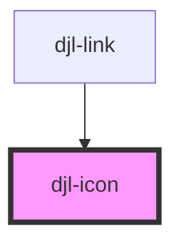

# djl-icon

## Usage
HTML template
```html
<djl-icon icon-config='{"unicode": "f076", "fontFamily": "fa-light", "ariaLabel": "label"}'></djl-icon>
```
Angular
```tsx
    rocketIconConfig = {
        unicode: 'e027',
        fontFamily: 'fa-solid',
    } as IIconConfig;
```
```html
<djl-icon [iconConfig]="rocketIconConfig"></djl-icon>
```

<!-- Auto Generated Below -->


## Properties

| Property     | Attribute     | Description                                      | Type                   | Default     |
| ------------ | ------------- | ------------------------------------------------ | ---------------------- | ----------- |
| `iconConfig` | `icon-config` | Icon config json object, or parsable json string | `IconConfig \| string` | `undefined` |


## Dependencies

### Used by

 - [djl-link](../link)

### Graph


----------------------------------------------

*Built with [StencilJS](https://stenciljs.com/)*
