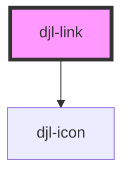

# djl-link

<!-- Auto Generated Below -->

## Properties

| Property            | Attribute        | Description                                                                                                                                   | Type                                         | Default     |
| ------------------- | ---------------- | --------------------------------------------------------------------------------------------------------------------------------------------- | -------------------------------------------- | ----------- |
| `djlAriaLabel`      | `djl-aria-label` |                                                                                                                                               | `string`                                     | `undefined` |
| `download`          | `download`       | If developer is specifying a download in the href, they need to specify a download name in order for the "download icon" to appear next to it | `string`                                     | `undefined` |
| `href` _(required)_ | `href`           |                                                                                                                                               | `string`                                     | `undefined` |
| `target`            | `target`         |                                                                                                                                               | `"_blank" \| "_parent" \| "_self" \| "_top"` | `undefined` |

## Dependencies

### Depends on

- [djl-icon](../icon)

### Graph

----------------------------------------------

*Built with [StencilJS](https://stenciljs.com/)*
